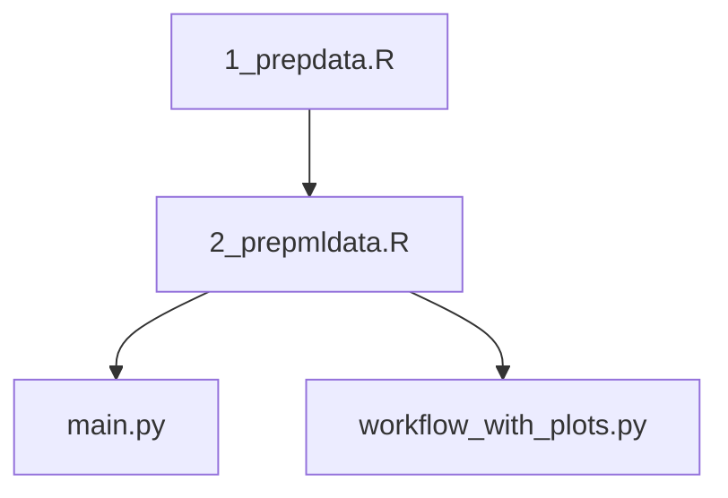

Run order: 


The rest of the scripts are dependencies for 2_prepmldata.R and main.py

All scripts are written to be placed in main directory 

To run python scripts:
```
# quick version (faster, fewer plots)
python main.py --quick --parallel

# full version (all plots)
python main.py --parallel

# no plots (just analysis)
python main.py --parallel --no-plots

# custom directories
python main.py --data-dir mydata --output-dir myresults --parallel

# or directly; this is what i did 
python workflow_with_plots.py
```

To run extraplots.py

```
python extraplots.py \
  --results ml_results/all_predictions.csv \
  --hourly  ml_data/hourly_activity_within.csv \
  --data-dir ml_data \
  --out poster_figures \
  --two-classes \ # modulates if it shows diurnal, nocturnal, cathremal, crespecular or just the first two
  --example-species "Danaus plexippus"
```
