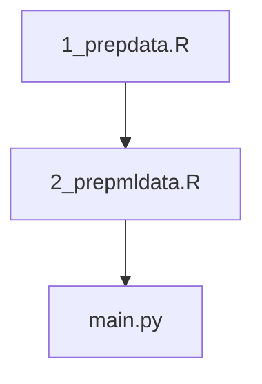

run order: 



To run python scripts:
```
# quick version (faster, fewer plots)
python main.py --quick --parallel

# full version (all plots)
python main.py --parallel

# no plots (just analysis)
python main.py --parallel --no-plots

# custom directories
python main.py --data-dir mydata --output-dir myresults --parallel

# or directly
python workflow_with_plots.py
```
